# Motion Controller vs. Servo Drive: A Complete Guide

Understanding the distinction between **motion controllers** and **servo drives** is essential when designing or working with precision motion systems. These are complementary components that work together to create coordinated, precise motion — each plays a critical and distinct role in the system architecture.

---

## 🧠 Motion Controller (The Brain)

The **motion controller** serves as the central intelligence of the motion system, responsible for high-level decision-making and motion planning. It orchestrates the entire motion sequence but does **not** directly power the motors.

### Key Responsibilities:
- **Trajectory Planning**: Generate smooth motion profiles (e.g., move 100 mm in 2 seconds with trapezoidal acceleration)
- **Multi-Axis Coordination**: Synchronize multiple axes for complex operations (e.g., XY gantry drawing precise geometric shapes)
- **Advanced Motion Functions**: 
  - Path interpolation (linear, circular, spline)
  - Forward/inverse kinematics for robotic applications
  - Electronic gearing and camming
  - Error compensation and recovery
- **System Communication**: Interface with host systems (PCs, PLCs) via Ethernet, fieldbus protocols
- **Real-Time Command Distribution**: Send precise **setpoints** (position, velocity, torque) to servo drives via high-speed communication buses (EtherCAT, CANopen, PROFINET)
- **Safety Supervision**: Monitor system state and implement safety interlocks

### Example Product:
**`ACS SPiiPlusEC-02020264GNNDNDNN`** — Advanced EtherCAT Master Controller
- **SP+EC**: SPiiPlus EtherCAT series
- **02020264**: Configuration code indicating:
  - Base 2-axis capability, upgradeable to **8 axes**
  - Further expansion possible up to **64 axes** with additional modules
- **EtherCAT Performance**: Cycle times up to **5 kHz** (200 µs)
- **GNNDNDNN**: Feature options including ServoBoost, MotionBoost, NetworkBoost enhancements  

---

## 💪 Servo Drive (The Muscle)

The **servo drive** functions as the power amplifier and real-time control executor. It receives high-level motion commands from the controller and translates them into precise motor control through advanced feedback loops.

### Key Responsibilities:
- **Real-Time Control Loops**:
  - **Current/Torque Loop**: Ultra-fast control (50-100 µs) for precise torque regulation
  - **Velocity Loop**: Fast control (250 µs - 1 ms) for speed regulation
  - **Position Loop**: Optional high-precision positioning (1-2 ms)
- **Power Conversion**: Transform DC bus voltage into high-frequency, sinusoidal phase currents for smooth motor operation
- **Feedback Processing**: Handle various encoder types (incremental, absolute, SinCos, resolvers, linear scales)
- **Motor Commutation**: Precise timing of phase currents for optimal motor performance
- **Protection Systems**: 
  - Overcurrent and short-circuit protection
  - Overtemperature monitoring
  - Safe Torque Off (STO) safety functions
  - Motor thermal protection
- **Performance Enhancement**: Optional advanced features like **ServoBoost** for sub-micron precision

### Example Products:

#### Compact Multi-Axis Drive:
**`ACS UDMsm-2B002-TNNNN`**
- **UDMsm**: Universal Drive Module, small form factor (space-efficient design)
- **2B**: 2-axis drive capability in single unit
- **002**: Continuous output current rating (2A per axis)
- **TNNNN**: Configuration options:
  - **T**: STO (Safe Torque Off) safety option
  - **NNNN**: I/O configuration and feedback interface options

#### Higher Power Multi-Axis Drive:
**`ACS UDMsm-4B000-TNNNN`**
- **4B**: 4-axis drive capability
- **000**: Base current rating (consult datasheet for specific amperage)
- **TNNNN**: Same safety and I/O option structure

> **Note**: These drives operate as **EtherCAT slaves** — they execute commands with precision but do not independently plan motion trajectories.

---

## 🏗️ Why Both Components Are Essential

The motion control system operates as a **hierarchical control architecture** where each component has specialized responsibilities:  
  - **2B** = 2-axis drive.  
  - **002** = Output current (2 A continuous).  
  - **TNNNN** = Options for STO, I/O, and feedback type.  

- **`ACS UDMsm-4B000-TNNNN`**  
  - **4B** = 4-axis drive.  
  - **000** = Output current (base/low-power).  
  - Same **TNNNN** tail for safety/feedback options.  

These drives are EtherCAT slaves — they don’t “plan” motion but execute the controller’s commands with precise current, velocity, and sometimes position loops.

---

## 🏗️ Why Both Are Needed

| Layer | Who Handles It | Purpose |
|-------|----------------|---------|
| High-level motion planning (trajectories, multi-axis sync, robotics, CNC) | **Motion Controller** | System brain |
| Low-level servo loops (torque, velocity, commutation) | **Servo Drive** | Motor muscle |
| Power conversion (DC/AC → motor phase currents) | **Servo Drive** | Actual muscle power |

- Without a **motion controller** → drives run independently with no coordination (chaotic motion).  
- Without a **servo drive** → the controller can compute trajectories but has no way to push current into the motors.  

Together, they form a **hierarchical control system**:  
- Controller: “Move XY gantry in a circle at 20 mm/s.” 
- Drive: “I’ll regulate my motor currents every 50 µs to follow exactly.” 

---

## 🎼 Perfect Analogy: Symphony Orchestra

Think of a motion control system like a world-class symphony orchestra:

| **Orchestra Role** | **Motion System** | **Responsibility** |
|-------------------|------------------|-------------------|
| **🎼 Conductor** | **Motion Controller** | Sets tempo, coordinates timing, ensures harmony across all sections |
| **🎻 Musicians** | **Servo Drives** | Execute precise notes with perfect timing and dynamics |
| **🎺 Instruments** | **Motors** | Produce the actual sound (motion) output |

### What Happens Without Coordination:
- **Conductor without musicians** = Beautiful planning, but silence (no execution)
- **Musicians without conductor** = Chaos and noise (uncoordinated motion)
- **Together** = Beautiful, synchronized music (coordinated precision motion)

---

## 🔌 Why ACS Uses Distributed Architecture

While some vendors integrate controller and drive into single units (suitable for simple systems), ACS and other high-performance suppliers use **distributed architecture** for compelling reasons:

### Scalability Benefits:
- **1 Controller → N Drives**: One motion controller can orchestrate **dozens of servo drives**
- **Modular Expansion**: Add axes incrementally without replacing the entire system
- **Cost Efficiency**: Don't pay for unused controller capacity in each drive

### Performance Advantages:
- **Optimized Placement**: Position drives close to motors (reduces cable length, electromagnetic interference)
- **Specialized Hardware**: Each component optimized for its specific function
- **Redundancy Options**: Replace individual drives without affecting the entire system

### Industrial Benefits:
- **Maintenance**: Service drives independently without system shutdown
- **Upgrades**: Replace or upgrade drives while keeping proven controller
- **Flexibility**: Mix different drive types (power ratings, motor types) on same controller

---

## 📊 Block Diagram (Mermaid)

Here’s a clean system block diagram written in **Mermaid**:

```mermaid
flowchart TD
    %% Define styles
    classDef controller fill:#e1f5fe,stroke:#01579b,stroke-width:2px
    classDef drive fill:#f3e5f5,stroke:#4a148c,stroke-width:2px
    classDef motor fill:#fff3e0,stroke:#e65100,stroke-width:2px
    classDef host fill:#e8f5e8,stroke:#1b5e20,stroke-width:2px
    classDef safety fill:#ffebee,stroke:#b71c1c,stroke-width:2px

    %% Main components
    Host["`**Host PC / HMI**
    • Motion planning
    • User interface
    • Process control`"]:::host

    Controller["`**Motion Controller**
    ACS SPiiPlusEC
    • Trajectory generation
    • Multi-axis coordination
    • Real-time communication`"]:::controller

    %% Drive and motor pairs
    Drive1["`**Servo Drive 1**
    ACS UDMsm-2B002
    • Current/velocity loops
    • Motor commutation
    • Power amplification`"]:::drive

    Motor1["`**Motor 1 + Encoder**
    • Rotary/linear motion
    • Position feedback
    • Velocity feedback`"]:::motor

    Drive2["`**Servo Drive 2**
    ACS UDMsm-4B000
    • Current/velocity loops
    • Motor commutation  
    • Power amplification`"]:::drive

    Motor2["`**Motor 2 + Encoder**
    • Rotary/linear motion
    • Position feedback
    • Velocity feedback`"]:::motor

    Safety["`**Safety System**
    • Emergency stops
    • Safe Torque Off (STO)
    • Safety I/O monitoring`"]:::safety

    %% Communication flows
    Host -.->|"Ethernet/TCP-IP<br/>Motion commands"| Controller
    Controller -.->|"EtherCAT Bus<br/>Position/Velocity setpoints<br/>200µs cycle time"| Drive1
    Controller -.->|"EtherCAT Bus<br/>Position/Velocity setpoints<br/>200µs cycle time"| Drive2

    %% Power and feedback
    Drive1 <-->|"3-Phase Power<br/>+ Encoder feedback"| Motor1
    Drive2 <-->|"3-Phase Power<br/>+ Encoder feedback"| Motor2

    %% Status reporting
    Drive1 -.->|"Status & diagnostics"| Controller
    Drive2 -.->|"Status & diagnostics"| Controller

    %% Safety connections
    Safety -->|"STO signals"| Drive1
    Safety -->|"STO signals"| Drive2
    Safety -.->|"Safety status"| Controller
```

### Key Communication Characteristics:
- **Host ↔ Controller**: Ethernet (TCP/IP) for high-level commands and setup
- **Controller ↔ Drives**: EtherCAT real-time bus (200µs cycle time) for precise setpoints
- **Drive ↔ Motor**: High-frequency PWM + encoder feedback loops (50-100µs)
- **Safety**: Hardwired STO (Safe Torque Off) for immediate motor shutdown

---

## 🔢 ACS Part Number Decoding Guide

Understanding ACS part numbers helps specify the exact configuration needed for your application. Each segment encodes specific capabilities and options.

### Motion Controller Example:
**`ACS SPiiPlusEC-02020264GNNDNDNN`**

| **Segment** | **Description** | **This Example** |
|-------------|-----------------|------------------|
| `SPiiPlusEC` | Product family: SPiiPlus EtherCAT Master Controller | ✓ EtherCAT Master |
| `02` | Base license: **2 motion axes** included | ✓ 2 axes base |
| `02` | First upgrade: **+2 axes** (total: 4) | ✓ Upgrade to 4 axes |
| `02` | Second upgrade: **+2 axes** (total: 6) | ✓ Upgrade to 6 axes |
| `64` | Third upgrade: **+2 axes** (total: 8, expandable to 64) | ✓ Up to 8 axes now |
| `GN` | **Gigabit Ethernet** host communication | ✓ GigE interface |
| `ND` | **No** additional digital I/O expansion | ✗ No extra digital I/O |
| `ND` | **No** additional analog I/O expansion | ✗ No extra analog I/O |
| `NN` | **No** optional performance/safety features | ✗ No ServoBoost/Safety |

**Result**: 8-axis EtherCAT master with Gigabit Ethernet, no I/O expansion, no performance enhancements.

### Servo Drive Examples:

#### Compact 2-Axis Drive:
**`ACS UDMsm-2B002-TNNNN`**

| **Segment** | **Description** | **This Example** |
|-------------|-----------------|------------------|
| `UDMsm` | Universal Drive Module, small form factor | ✓ Compact design |
| `2B` | **2-axis** drive in single unit | ✓ Dual axis capability |
| `002` | Continuous current: **2A per axis** | ✓ 2A continuous rating |
| `T` | **STO** (Safe Torque Off) safety option | ✓ Safety compliant |
| `NNNN` | I/O and feedback configuration options | Varies by application |

#### Higher Power 4-Axis Drive:
**`ACS UDMsm-4B000-TNNNN`**

| **Segment** | **Description** | **This Example** |
|-------------|-----------------|------------------|
| `UDMsm` | Universal Drive Module, small form factor | ✓ Compact design |
| `4B` | **4-axis** drive capability | ✓ Quad axis capability |
| `000` | Base current rating (see datasheet) | ✓ Standard power |
| `T` | **STO** (Safe Torque Off) safety option | ✓ Safety compliant |
| `NNNN` | I/O and feedback configuration options | Varies by application |

### Configuration Benefits:
- **Scalable**: Start small, upgrade incrementally
- **Flexible**: Mix different drive types on same controller
- **Optimized**: Pay only for capabilities you need
- **Future-proof**: Upgrade path available for expansion

---

## 🎯 Key Takeaways

### Remember the Hierarchy:
1. **Motion Controller** = Strategic planner and coordinator
2. **Servo Drive** = Tactical executor and power amplifier  
3. **Motor + Feedback** = Physical actuator with sensing

### When Selecting Components:
- **Start with motion requirements**: Speed, precision, coordination complexity
- **Choose controller first**: Based on axes count, trajectory complexity, communication needs
- **Select drives second**: Based on motor power, feedback type, safety requirements
- **Plan for expansion**: ACS distributed architecture scales from 2 to 64+ axes

### The ACS Advantage:
✅ **Proven Performance**: Sub-micron precision with ServoBoost technology  
✅ **Scalable Architecture**: Grow from 2 axes to complex multi-axis systems  
✅ **Real-time Control**: EtherCAT bus with 200µs cycle times  
✅ **Industrial Reliability**: Built for 24/7 operation in demanding environments  
✅ **Global Support**: Comprehensive documentation and technical support worldwide

*Ready to design your precision motion system? Start with defining your motion requirements, then map them to the appropriate ACS controller and drive combination.*  
- Letters (like `GN`, `T`, `NNNN`) represent **options** (Ethernet, safety, feedback, I/O).  

