# 📖 GenICam vs. GigE Vision — A Practical, Packet-Level Guide

[](https://opensource.org/licenses/MIT)
[](https://www.emva.org/)
[](https://www.visiononline.org/)

> **TL;DR**  
> - **GenICam**: a **universal control/feature abstraction** for cameras (exposure, gain, trigger, pixel format) defined by an **XML** model.  
> - **GigE Vision**: an **Ethernet transport standard** that defines **control (GVCP)** and **streaming (GVSP)** over **UDP/IP**.
> - **Together**: They provide vendor-agnostic, high-performance machine vision over standard Ethernet infrastructure.

---

## Table of Contents

- [📖 GenICam vs. GigE Vision — A Practical, Packet-Level Guide](#-genicam-vs-gige-vision--a-practical-packet-level-guide)
  - [Table of Contents](#table-of-contents)
  - [🚀 Getting Started](#-getting-started)
  - [📚 Quick Definitions](#-quick-definitions)
  - [🍕 Pizza Analogy (Elaborated)](#-pizza-analogy-elaborated)
    - [Cast](#cast)
    - [Flow](#flow)
  - [🏗️ Layered View \& OSI Mapping](#️-layered-view--osi-mapping)
    - [High-Level Stack](#high-level-stack)
    - [OSI Model Mapping (Who lives where)](#osi-model-mapping-who-lives-where)
  - [📦 Packet Journey: Down \& Up the Stack](#-packet-journey-down--up-the-stack)
    - [Control Path (Down)](#control-path-down)
    - [Stream Path (Up)](#stream-path-up)
    - [Code Example: Typical GenICam Usage](#code-example-typical-genicam-usage)
    - [Network Packet Example](#network-packet-example)
  - [⚖️ Comparisons: HTTP/REST vs. Modbus/TCP vs. GigE+GenICam](#️-comparisons-httprest-vs-modbustcp-vs-gigegenicam)
    - [Side-by-Side Table](#side-by-side-table)
    - [Intuition Mapping](#intuition-mapping)
  - [💼 Practical Use Cases](#-practical-use-cases)
    - [🚗 Traffic Monitoring](#-traffic-monitoring)
    - [🏭 Factory Quality Assurance](#-factory-quality-assurance)
    - [🔬 Scientific Microscopy](#-scientific-microscopy)
    - [📊 Performance Expectations](#-performance-expectations)
  - [🔌 Choosing a Transport (GigE vs USB3 vs CoaXPress)](#-choosing-a-transport-gige-vs-usb3-vs-coaxpress)
  - [🛠️ Troubleshooting \& Tuning Tips](#️-troubleshooting--tuning-tips)
    - [🔧 Network Optimization](#-network-optimization)
    - [📈 Performance Tuning Checklist](#-performance-tuning-checklist)
  - [🔍 Wireshark Cheat Sheet](#-wireshark-cheat-sheet)
    - [Essential Filters](#essential-filters)
    - [What to Look For](#what-to-look-for)
  - [❓ FAQ](#-faq)
    - [Basic Concepts](#basic-concepts)
    - [Performance \& Troubleshooting](#performance--troubleshooting)
    - [Development](#development)
  - [📖 Glossary](#-glossary)
    - [One-Page Mental Model](#one-page-mental-model)
  - [🔗 Additional Resources](#-additional-resources)
    - [Official Standards \& Documentation](#official-standards--documentation)
    - [Free SDKs \& Tools](#free-sdks--tools)
    - [Learning \& Community](#learning--community)
    - [Hardware Vendors](#hardware-vendors)

---

## 🚀 Getting Started

**New to machine vision?** Start here:

1. **Read** [Quick Definitions](#-quick-definitions) to understand the basics
2. **Visualize** with the [Pizza Analogy](#-pizza-analogy-elaborated) 
3. **Explore** the [Layered View](#️-layered-view--osi-mapping) for technical depth
4. **Practice** with [Practical Use Cases](#-practical-use-cases)

**Already familiar with networking?** Jump to [Comparisons](#️-comparisons-httprest-vs-modbustcp-vs-gigegenicam) to map concepts you know.

---

## 📚 Quick Definitions

- **GenICam**: A standard ([EMVA 1288](https://www.emva.org/standards-technology/genicam/)) that defines a **generic camera programming model**. Cameras describe their features (e.g., `ExposureTime`, `Gain`, `TriggerMode`, `PixelFormat`) through a **GenICam XML** file. Your application/library reads this XML and exposes a consistent API **regardless of vendor or transport**.

- **GigE Vision**: A standard ([AIA GigE Vision 2.2](https://www.visiononline.org/vision-standards-details.cfm?type=5)) that defines how cameras and hosts communicate over **Ethernet**. It contains:
  - **GVCP (GigE Vision Control Protocol)** — small **UDP** packets (default **UDP/3956**) for **discovery, configuration, start/stop**.
  - **GVSP (GigE Vision Streaming Protocol)** — **UDP** packets that carry **image payload** (on a negotiated high UDP port).

> **Relationship:** Every **GigE Vision**–compliant camera uses **GenICam** to describe its features. **GenICam** itself can be used with **other transports** too (USB3 Vision, CoaXPress, etc.).

**Key Numbers:**
- 🌐 **Bandwidth**: 1 GbE = ~125 MB/s, 10 GbE = ~1.25 GB/s theoretical
- 📏 **Distance**: 100m over copper, km+ over fiber
- 🎯 **Latency**: ~50-200μs depending on packet size and network config
- 📊 **Packet Size**: Typically 1500-9000 bytes (standard to jumbo frames)

---

## 🍕 Pizza Analogy (Elaborated)

We’ll map **every major concept** to pizza delivery so it sticks.

### Cast
- **You** = Host Application (your software)
- **Restaurant** = Camera hardware
- **Menu (same look across restaurants)** = **GenICam XML** (standardized features)
- **Ordering UI** = **GenICam API** (the library you call)
- **Dispatcher** = **GVCP Control** (small UDP control messages)
- **Delivery Truck & Roads** = **GVSP over UDP/IP on Ethernet** (image data transport)
- **Pizza Boxes** = **GVSP packets** (image chunks)
- **Order ID** = **BlockID** (frame ID)
- **Box Sequence Number** = **PacketID** (packet index within a frame)
- **Delivery Confirmation** = **GVCP Acks**

### Flow
1. **You browse the menu**: You discover what the camera supports (exposure, gain, trigger…).  
   - Reality: The host pulls/parses the **GenICam XML** and shows you standardized feature names and ranges.

2. **You place an order**: “Large Pepperoni, extra cheese.”  
   - Reality: You call `Set(ExposureTime = 20000 µs)`, `Set(PixelFormat = Mono16)`, etc.  
   - The **GenICam API** translates this into **register writes** and sends a **GVCP command** (`WriteRegister`) over **UDP/3956**.

3. **Dispatcher confirms the order**: “Got it, starting prep.”  
   - Reality: Camera replies with **GVCP Ack** confirming the setting.

4. **You say “start cooking & deliver”**: Start acquisition.  
   - Reality: A **GVCP** command triggers acquisition (configures stream channel, packet size, buffer settings).

5. **Pizza leaves the restaurant**: Multiple boxes on the truck.  
   - Reality: Camera streams **GVSP** packets (**UDP**) — each with **[GVSP Header | Image Chunk]**.  
   - **BlockID = order ID** (which frame), **PacketID = box number** (which packet in the frame).

6. **Truck arrives; you reassemble the pizza**: You collect boxes 1..N and plate the pizza.  
   - Reality: The host’s SDK/driver reassembles all **GVSP** packets with the same BlockID and PacketID order into a complete frame buffer. Missing boxes?  
     - Some stacks request **re-send** via control channel (**GVCP**). Others drop the frame or mark it partial.

7. **You take a bite**: App processes/display the image.  
   - Reality: SDK delivers a finished **image buffer** to your app.

> **Why two things (GenICam + GigE Vision)?**  
> - **GenICam** makes **ordering** consistent across all restaurants (cameras).  
> - **GigE Vision** makes **delivery** consistent, fast, and long-distance over Ethernet.

---

## 🏗️ Layered View & OSI Mapping

### High-Level Stack


### OSI Model Mapping (Who lives where)


**Notes**
- **GenICam** operates as an **abstraction** (Presentation + parts of Application/Session) — it’s **not a wire protocol**.  
- **GigE Vision** defines the **on-the-wire** messages:
  - **GVCP (control)**: Discovery, feature reads/writes (UDP/3956).  
  - **GVSP (stream)**: Image payload split across UDP packets (high port).

---

## 📦 Packet Journey: Down & Up the Stack

### Control Path (Down)
1. **App** calls `AcquisitionStart()` or `ExposureTime = 20000`.
2. **GenICam API** maps feature → register operation (from XML).
3. **GVCP** packet created: `WriteRegister` (UDP/3956).
4. Encapsulated: **UDP → IP → Ethernet → Cable** to camera.

### Stream Path (Up)
1. Camera captures a frame.  
2. Splits the frame into **GVSP** packets; each packet has:
   - **BlockID** (frame ID)
   - **PacketID** (sequence within the frame)
   - **Payload** (image chunk bytes)
3. Encapsulated: **GVSP → UDP → IP → Ethernet** back to host.
4. **Host SDK** reassembles by BlockID/PacketID; missing packets handled by policy (resend/drop/partial).
5. App receives a complete **image buffer**.

### Code Example: Typical GenICam Usage

```python
# Pseudo-code using a typical GenICam SDK
import genicam_api as gc

# Discover and connect to camera
camera = gc.discover_cameras()[0]
camera.connect()

# Configure camera features (standardized across vendors)
camera.set_feature("ExposureTime", 20000)  # 20ms
camera.set_feature("PixelFormat", "Mono16")
camera.set_feature("TriggerMode", "Off")
camera.set_feature("AcquisitionMode", "Continuous")

# Start acquisition (triggers GVCP commands)
camera.start_acquisition()

# Capture frames (GVSP streaming)
for i in range(10):
    image = camera.get_next_image(timeout_ms=1000)
    print(f"Frame {i}: {image.width}x{image.height}, {len(image.data)} bytes")

camera.stop_acquisition()
```

### Network Packet Example

```
GVCP Control Packet (WriteRegister):
┌─────────────┬─────────────┬─────────────┬─────────────┐
│ Magic: 0x42 │ Flags: 0x01 │ Command: 82 │ Length: 16  │
├─────────────┼─────────────┼─────────────┼─────────────┤
│ ReqID: 1234 │ Address: 0x12004 (ExposureTime reg)    │
├─────────────┼─────────────┼─────────────┼─────────────┤
│ Value: 20000 (microseconds)                          │
└─────────────┴─────────────┴─────────────┴─────────────┘

GVSP Streaming Packet:
┌─────────────┬─────────────┬─────────────┬─────────────┐
│ Magic: 0x42 │ Flags: 0x00 │ Format: 0x01│ BlockID: 42 │
├─────────────┼─────────────┼─────────────┼─────────────┤
│ PacketID: 1 │ [1400 bytes of image data...]          │
└─────────────┴─────────────┴─────────────┴─────────────┘
```



```mermaid
sequenceDiagram
    participant App as "Host Application"
    participant Gen as "GenICam API"
    participant Net as "UDP/IP/Ethernet"
    participant Cam as "Camera"

    App->>Gen: "Set(ExposureTime = 20000µs)"
    Gen->>Net: "GVCP WriteRegister (UDP/3956)"
    Net->>Cam: "GVCP Cmd"
    Cam-->>Net: "GVCP Ack"

    App->>Gen: "AcquisitionStart()"
    Gen->>Net: "GVCP Start/Config Stream"
    Net->>Cam: "GVCP Cmd"
    Cam-->>Net: "GVCP Ack"

    Cam-->>Net: "GVSP Packet(BlockID=42, PacketID=1, chunk...)"
    Cam-->>Net: "GVSP Packet(BlockID=42, PacketID=2, chunk...)"
    Cam-->>Net: "GVSP Packet(...)"
    Net-->>Gen: "Reassemble frame by BlockID/PacketID"
    Gen-->>App: "Deliver Image Buffer"
```

**Reliability considerations (UDP):**
- UDP is **best-effort**; packets can be lost or reordered.  
- Many stacks implement **resend** via GVCP.  
- Best practice: tune **packet size/MTU** and **NIC/driver buffers** to reduce loss.

---

## ⚖️ Comparisons: HTTP/REST vs. Modbus/TCP vs. GigE+GenICam

### Side-by-Side Table

| Aspect                     | GigE Vision + GenICam                               | HTTP/REST                                  | Modbus/TCP                         |
|---------------------------|------------------------------------------------------|--------------------------------------------|------------------------------------|
| Primary use               | **Industrial imaging** over Ethernet                | Web / APIs                                  | Industrial **I/O registers**       |
| Transport                 | **UDP/IP** (control & data)                         | **TCP/IP**                                  | **TCP/IP**                         |
| Control channel           | **GVCP** (UDP/3956)                                  | HTTP verbs (GET/POST/PUT/DELETE)            | Function codes (read/write regs)   |
| Data channel              | **GVSP** (UDP high port; image chunks)              | HTTP message body (over TCP stream)         | Register response payload           |
| Feature abstraction       | **GenICam XML** (vendor-agnostic)                   | OpenAPI/JSON schema (often)                 | Fixed register map per device      |
| Reliability               | Best-effort; resend mechanisms possible              | TCP guarantees order & delivery             | TCP guarantees order & delivery    |
| Framing                   | GVSP packets w/ BlockID & PacketID                   | Streamed bytes segmented by TCP             | Discrete PDU per request/response  |
| Typical payload           | **High-throughput images**                           | Documents/JSON/Binary                       | 16-bit registers / coils           |
| Discovery                 | GVCP discovery (broadcast/unicast)                   | mDNS/DNS/manual                             | Manual/IP scan                     |

### Intuition Mapping
- **GenICam** ≈ OpenAPI/Swagger **spec** + client SDK: standard names/constraints for “resources” (camera features).  
- **GVCP** ≈ Small control calls (like REST control endpoints).  
- **GVSP** ≈ Bulk data stream (like a continuous file download/video stream) but **over UDP** for throughput/latency.

> If you know **HTTP/REST**: imagine your **control plane** is REST-like and your **data plane** is a fast **UDP stream**.  
> If you know **Modbus/TCP**: GVCP **feels** like “write coil / write register,” while GVSP is the **high-bandwidth cousin** for images.

---

## 💼 Practical Use Cases

### 🚗 Traffic Monitoring
```python
# Configure for outdoor, high-speed capture
camera.set_feature("ExposureTime", 500)  # 0.5ms for motion freeze
camera.set_feature("Gain", 10)           # Boost for low light
camera.set_feature("TriggerMode", "Off")  # Continuous capture
camera.set_feature("PixelFormat", "BayerRG8")  # Color for plate ID
```
**Network**: 100m copper to control room, jumbo frames for 4K@30fps

### 🏭 Factory Quality Assurance
```python
# Sync with production line encoder
camera.set_feature("TriggerMode", "On")
camera.set_feature("TriggerSource", "Line1")    # External trigger
camera.set_feature("ExposureTime", 1000)        # 1ms controlled exposure
camera.set_feature("PixelFormat", "Mono12")     # High dynamic range
```
**Network**: Dedicated VLAN, deterministic timing critical

### 🔬 Scientific Microscopy
```python
# High-resolution, slow acquisition
camera.set_feature("ExposureTime", 50000)       # 50ms for low noise
camera.set_feature("Gain", 0)                   # Minimal gain
camera.set_feature("PixelFormat", "Mono16")     # Maximum bit depth
camera.set_feature("AcquisitionFrameRate", 5.0) # 5 FPS sustainable
```
**Network**: 10 GbE for 16MP@5fps = ~160 MB/s sustained throughput

### 📊 Performance Expectations

| Application | Resolution | FPS | Bandwidth | Key Settings |
|-------------|------------|-----|-----------|--------------|
| License Plate | 2MP | 30 | ~180 MB/s | Fast exposure, outdoor gain |
| PCB Inspection | 5MP | 10 | ~150 MB/s | Line trigger, high precision |
| Microscopy | 16MP | 5 | ~160 MB/s | Long exposure, minimal gain |
| Sports Broadcast | 4K | 60 | ~480 MB/s | Global shutter, color |

---

## 🔌 Choosing a Transport (GigE vs USB3 vs CoaXPress)

- **GigE Vision**: Long cables (100m copper, further with fiber), easy networking, high throughput (1/2.5/5/10/25/100 GbE options).  
- **USB3 Vision**: Shorter cables, plug-and-play, high bandwidth on-device; fewer network complexities.  
- **CoaXPress**: Very high bandwidth & low latency, long distances over coax; needs frame grabbers.

> **GenICam** works with **all** of the above. Your app logic stays stable.

---

## 🛠️ Troubleshooting & Tuning Tips

### 🔧 Network Optimization

| Issue | Symptom | Solution |
|-------|---------|----------|
| **Packet Loss** | Incomplete frames, resends | Increase NIC buffers, use jumbo frames |
| **High Latency** | Delayed frame delivery | Reduce packet size, optimize NIC settings |
| **Bandwidth Limit** | Frame drops at high FPS | Upgrade to faster Ethernet, dedicated NIC |
| **Jitter** | Inconsistent frame timing | Use dedicated VLAN, QoS settings |

### 📈 Performance Tuning Checklist

- **Jumbo Frames/MTU**: Use larger MTU (e.g., 9000) end-to-end to reduce packet rate and loss (NIC ↔ switches ↔ camera must match).
- **NIC Settings**: Increase **receive buffers**, enable **interrupt moderation**, pin IRQs if needed.
- **Packet Size**: Align GVSP packet size to network MTU (account for Ethernet/IP/UDP/GVSP headers).
- **Separate VLAN/NIC**: Dedicate a NIC or VLAN for cameras to avoid contention with other traffic.
- **CPU/Memory**: Ensure zero-copy paths where possible; use fast disk for sustained recording.
- **Resend/Timeouts**: Enable resend in SDK if supported; monitor for partial frames (dropped packets).

---

## 🔍 Wireshark Cheat Sheet

### Essential Filters
```bash
# Core protocols
gvcp                          # GigE Vision control packets (UDP/3956)
gvsp                          # GigE Vision streaming packets
udp.port == 3956              # GVCP default control port
ip.addr == 192.168.1.100      # Isolate specific camera

# Advanced analysis
gvcp.command == 0x0082        # WriteRegister commands
gvsp.blockid == 42            # Track specific frame
udp.length > 1400             # Large packets (potential issues)
```

### What to Look For
- **Discovery**: GVCP DiscoveryCmd/DiscoveryAck exchanges
- **Register Writes**: WriteRegister/WriteMemory commands for settings
- **Streaming**: GVSP with increasing **PacketID** per **BlockID** frame
- **Loss**: Gaps in PacketID, resend requests, partial frames

---

## ❓ FAQ

### Basic Concepts

**Q: Do I need both GenICam and GigE Vision?**  
**A:** If you pick **GigE Vision**, **GenICam is guaranteed** (part of the standard). GenICam alone does **not** guarantee GigE — you still choose a transport (GigE, USB3, CoaXPress…).

**Q: Why UDP and not TCP?**  
**A:** Lower latency and higher throughput for large image streams; apps can tolerate occasional loss or implement resend/control-plane recovery.

**Q: Can I mix multiple cameras?**  
**A:** Yes. GenICam makes control uniform; GigE networking practices (VLANs, QoS, bandwidth provisioning) ensure clean streaming.

### Performance & Troubleshooting

**Q: My camera keeps dropping frames. What should I check?**  
**A:** 
1. Check network utilization (should be <80% of link capacity)
2. Verify jumbo frames enabled end-to-end
3. Increase NIC receive buffers
4. Use dedicated NIC/VLAN for cameras

**Q: How do I calculate bandwidth requirements?**  
**A:** `Bandwidth = Width × Height × Bits_per_Pixel × FPS ÷ 8`  
Example: 2MP @ 30fps, 12-bit = 2048×1536×12×30÷8 = **142 MB/s**

**Q: What's the maximum cable length for GigE Vision?**  
**A:** 
- **Copper (Cat5e/6)**: 100m standard
- **Fiber**: Several kilometers depending on optics
- **PoE+**: May reduce to 55m for high-power cameras

**Q: Can I use standard network switches?**  
**A:** Yes, but managed switches with QoS, VLAN support recommended for production. Avoid cheap unmanaged switches for multi-camera setups.

### Development

**Q: Which SDK should I use?**  
**A:** Popular choices:
- **Basler Pylon** (free, Basler cameras)
- **Allied Vision Vimba** (free, AVT cameras)  
- **FLIR Spinnaker** (free, FLIR cameras)
- **Genicam GenTL** (standard interface, any vendor)

**Q: How do I handle different pixel formats?**  
**A:** GenICam standardizes format names (`Mono8`, `Mono16`, `BayerRG8`, etc.). Your code reads the XML to discover supported formats and converts as needed.

---

## 📖 Glossary

- **GenICam XML**: Machine-readable feature tree (standard names/types/ranges).  
- **GVCP**: Control protocol over UDP/3956 (discovery, register/memory read/write).  
- **GVSP**: Streaming protocol over UDP (frame split into packets with BlockID/PacketID).  
- **BlockID**: Frame identifier.  
- **PacketID**: Packet index within a frame.  
- **MTU/Jumbo Frames**: Maximum transmission unit; bigger MTU → fewer packets per frame.  
- **NIC**: Network interface card.
- **GenTL**: Generic Transport Layer interface for GenICam.
- **PFNC**: Pixel Format Naming Convention (standardized pixel format names).
- **EMVA**: European Machine Vision Association (GenICam standard body).
- **AIA**: Automated Imaging Association (GigE Vision standard body).

---

### One-Page Mental Model

- **GenICam = WHAT you set (portable control)**  
- **GigE Vision = HOW pixels move (fast Ethernet)**  
- Control plane = **GVCP**, Data plane = **GVSP**.  
- Think **menu & ordering vs. trucks & roads**.

---

## 🔗 Additional Resources

### Official Standards & Documentation
- 📋 [GenICam Standard (EMVA 1288)](https://www.emva.org/standards-technology/genicam/) - Official GenICam specification
- 🌐 [GigE Vision 2.2 (AIA)](https://www.visiononline.org/vision-standards-details.cfm?type=5) - Official GigE Vision standard
- 📚 [GenICam PFNC](https://www.emva.org/wp-content/uploads/GenICam_PFNC_2_1.pdf) - Pixel Format Naming Convention

### Free SDKs & Tools
- 🔧 [Basler Pylon SDK](https://www.baslerweb.com/en/sales-support/downloads/software-downloads/) - Comprehensive, well-documented
- 🛠️ [Allied Vision Vimba SDK](https://www.alliedvision.com/en/products/software.html) - Cross-platform support
- ⚡ [FLIR Spinnaker SDK](https://www.flir.com/products/spinnaker-sdk/) - High-performance imaging
- 🔍 [GenICam Browser](https://www.emva.org/standards-technology/genicam/genicam-downloads/) - Feature exploration tool

### Learning & Community
- 💡 [Machine Vision Online](https://www.machinevisiononline.org/) - Industry news and tutorials
- 🎓 [EMVA Academy](https://www.emva.org/emva-academy/) - Training courses
- 🗣️ [Reddit r/computervision](https://www.reddit.com/r/computervision/) - Community discussions
- 📖 [Vision Systems Design](https://www.vision-systems.com/) - Technical articles

### Hardware Vendors
- 📷 **Cameras**: Basler, Allied Vision, FLIR, Cognex, IDS, Photonfocus
- 🔌 **NICs**: Intel, Mellanox, Broadcom (look for SR-IOV support)
- 🌐 **Switches**: Cisco, Netgear, HPE (managed switches recommended)
- 💾 **Frame Grabbers**: Euresys, EPIX, BitFlow (for CoaXPress/Camera Link)

---
