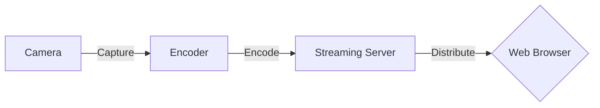

# Video Streaming Guide

This guide provides an overview of key concepts in video streaming technology including encoding, container formats, and streaming protocols. It also includes a simple line diagram to illustrate the flow of video streaming.

## Encoding (Video Codecs)

**Encoding**, or **video compression**, is the process of converting raw video input into a digital format that takes up less storage space and bandwidth. This is done using various algorithms that reduce redundancies in video data, allowing videos to be efficiently stored and transmitted over networks. The result of encoding video is a stream of compressed data that can be decoded (played back) by compatible devices.

### Common Video Codecs:
- **H.264 (AVC)**: Advanced Video Coding, widely supported, known for good video quality at low bitrates.
- **H.265 (HEVC)**: High Efficiency Video Coding, known for better compression ratios, suitable for 4K content.
- **VP8/VP9**: Open video codecs by Google. VP9 is better for high-resolution videos.
- **AV1**: Newest codec designed to be more efficient and royalty-free.

## Container Formats

A **container** or wrapper format is used to store the encoded video along with audio, metadata, subtitles, etc., in a single file or stream. The container manages the different types of data within it and ensures that they are kept in sync during playback.

### Common Container Formats:
- **MP4 (MPEG-4 Part 14)**: Supports multiple codecs, widely used for its compatibility.
- **WebM**: Optimized for the web, supports VP8/VP9 video codecs.
- **MKV (Matroska)**: Highly flexible, supports almost any codec.
- **AVI**: Older format, supports multiple streams of audio and video.

## Streaming Protocols

**Streaming protocols** define how data is transmitted across a network. They play a crucial role in how effectively and efficiently video is streamed from servers to clients.

### Common Streaming Protocols:
- **HLS (HTTP Live Streaming)**
- **DASH (Dynamic Adaptive Streaming over HTTP)**
- **RTMP (Real-Time Messaging Protocol)**
- **WebRTC (Web Real-Time Communication)**

## Protocol Comparison Table

| Protocol | Description                          | Usage                        |
|----------|--------------------------------------|------------------------------|
| HLS      | HTTP-based, breaks video into chunks | Broad compatibility, streaming |
| DASH     | Adaptive streaming over HTTP         | Quality adaptive streams     |
| RTMP     | Real-time streaming                  | Live broadcasting            |
| WebRTC   | Real-time communication              | Live interactions, peer-to-peer |

## Streaming Flow Diagram

# Video Streaming Guide - Detailed Protocol and Format Table

This table categorizes and details the steps, protocols, formats, and data transformations involved in the video streaming process.

| Step                 | Name/Protocol            | Description                                                                                           | Typical Use Case                             | Data Transformation                        |
|----------------------|--------------------------|-------------------------------------------------------------------------------------------------------|----------------------------------------------|--------------------------------------------|
| **Encoding**         | H.264 (AVC)              | Advanced Video Coding, efficient at low bitrates                                                      | General streaming, recording                 | Compresses raw video to H.264 format       |
|                      | H.265 (HEVC)             | High Efficiency Video Coding, better for high resolutions                                             | 4K/8K streaming                              | Compresses raw video to H.265 format       |
|                      | VP9                      | Open video codec developed by Google, efficient for HD                                                | High-definition web streaming                | Compresses raw video to VP9 format         |
|                      | AV1                      | Open-source codec designed for video transmissions over the Internet                                  | Future-proofing, royalty-free streaming      | Compresses raw video to AV1 format         |
| **Container Formats**| MP4                      | MPEG-4 Part 14, supports a broad range of codecs                                                      | Universal video file format                  | Wraps encoded video in MP4 container       |
|                      | WebM                     | Optimized for the web, supports VP8/VP9 and Vorbis/Opus                                               | Web-based streaming                          | Wraps encoded video in WebM container      |
|                      | MKV (Matroska)           | Supports almost any codec and high-quality video                                                      | Storage, high-quality video transfers        | Wraps encoded video in MKV container       |
|                      | AVI                      | Older format, supports multiple streams of audio and video                                            | Legacy systems, simple editing               | Wraps encoded video in AVI container       |
| **Streaming Protocols**| HLS                    | HTTP Live Streaming, splits video into small segments                                                 | Live streaming, VOD platforms                | Streams MP4 or TS segments over HTTP       |
|                      | MPEG-DASH                | Dynamic Adaptive Streaming over HTTP, standard for adaptive bitrate streaming                        | Adaptive streaming across various networks   | Streams MP4 or TS segments over HTTP       |
|                      | RTMP                     | Real-Time Messaging Protocol, maintained by Adobe                                                     | Real-time streaming, broadcasting            | Streams FLV over TCP                       |
|                      | WebRTC                   | Enables real-time communication via simple APIs                                                       | Interactive livestreams, video conferencing  | Streams raw, compressed video over UDP/TCP |

## Diagram of Video Streaming Flow

This diagram visually represents the steps and components involved in video streaming, including data transformations.

