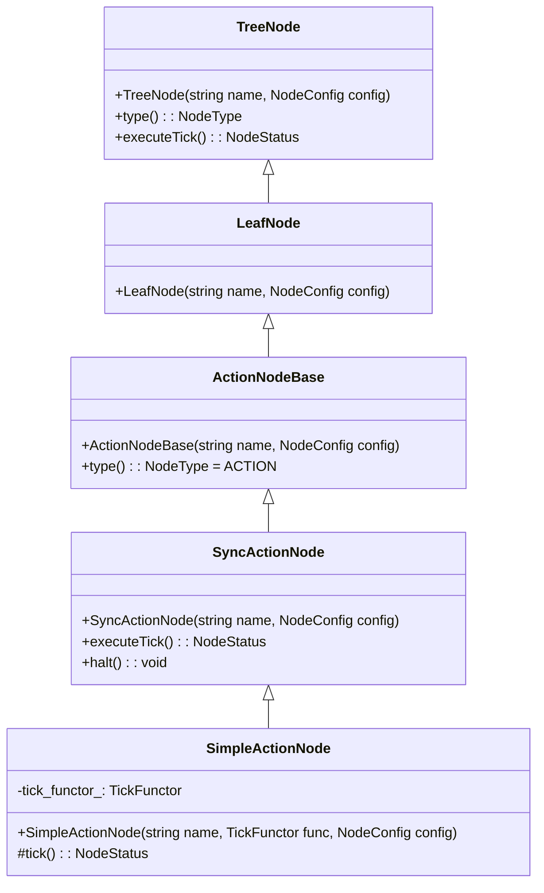

```mermaid
classDiagram
    TreeNode <|-- LeafNode
    LeafNode <|-- ActionNodeBase
    ActionNodeBase <|-- SyncActionNode
    SyncActionNode <|-- SimpleActionNode

    class TreeNode {
        +TreeNode(string name, NodeConfig config)
        +type(): NodeType
        +executeTick(): NodeStatus
    }
    class LeafNode {
        +LeafNode(string name, NodeConfig config)
    }
    class ActionNodeBase {
        +ActionNodeBase(string name, NodeConfig config)
        +type(): NodeType = ACTION
    }
    class SyncActionNode {
        +SyncActionNode(string name, NodeConfig config)
        +executeTick(): NodeStatus
        +halt(): void
    }
    class SimpleActionNode {
        +SimpleActionNode(string name, TickFunctor func, NodeConfig config)
        -tick_functor_: TickFunctor
        #tick(): NodeStatus
    }

```
