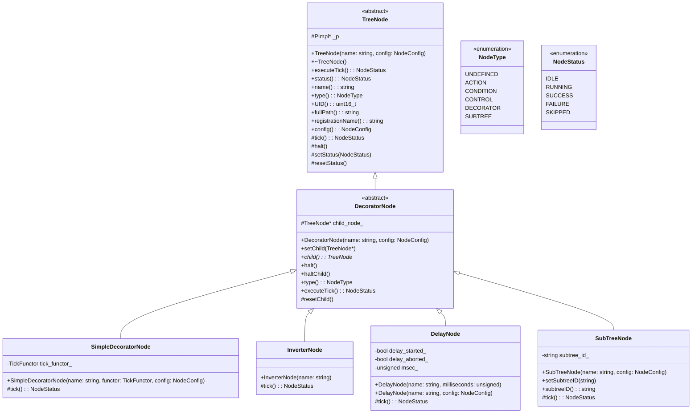

```mermaid
classDiagram
    class TreeNode {
        <<abstract>>
        #PImpl* _p
        +TreeNode(name: string, config: NodeConfig)
        +~TreeNode()
        +executeTick(): NodeStatus
        +status(): NodeStatus
        +name(): string
        +type(): NodeType
        +UID(): uint16_t
        +fullPath(): string
        +registrationName(): string
        +config(): NodeConfig
        #tick(): NodeStatus
        #halt()
        #setStatus(NodeStatus)
        #resetStatus()
    }

    class DecoratorNode {
        <<abstract>>
        #TreeNode* child_node_
        +DecoratorNode(name: string, config: NodeConfig)
        +setChild(TreeNode*)
        +child(): TreeNode*
        +halt()
        +haltChild()
        +type(): NodeType
        +executeTick(): NodeStatus
        #resetChild()
    }

    class SimpleDecoratorNode {
        -TickFunctor tick_functor_
        +SimpleDecoratorNode(name: string, functor: TickFunctor, config: NodeConfig)
        #tick(): NodeStatus
    }

    class InverterNode {
        +InverterNode(name: string)
        #tick(): NodeStatus
    }

    class DelayNode {
        -bool delay_started_
        -bool delay_aborted_ 
        -unsigned msec_
        +DelayNode(name: string, milliseconds: unsigned)
        +DelayNode(name: string, config: NodeConfig)
        #tick(): NodeStatus
    }

    class SubTreeNode {
        -string subtree_id_
        +SubTreeNode(name: string, config: NodeConfig)
        +setSubtreeID(string)
        +subtreeID(): string
        #tick(): NodeStatus
    }

    TreeNode <|-- DecoratorNode
    DecoratorNode <|-- SimpleDecoratorNode
    DecoratorNode <|-- InverterNode 
    DecoratorNode <|-- DelayNode
    DecoratorNode <|-- SubTreeNode

    class NodeType {
        <<enumeration>>
        UNDEFINED
        ACTION
        CONDITION
        CONTROL
        DECORATOR
        SUBTREE
    }

    class NodeStatus {
        <<enumeration>> 
        IDLE
        RUNNING
        SUCCESS
        FAILURE
        SKIPPED
    }

```
