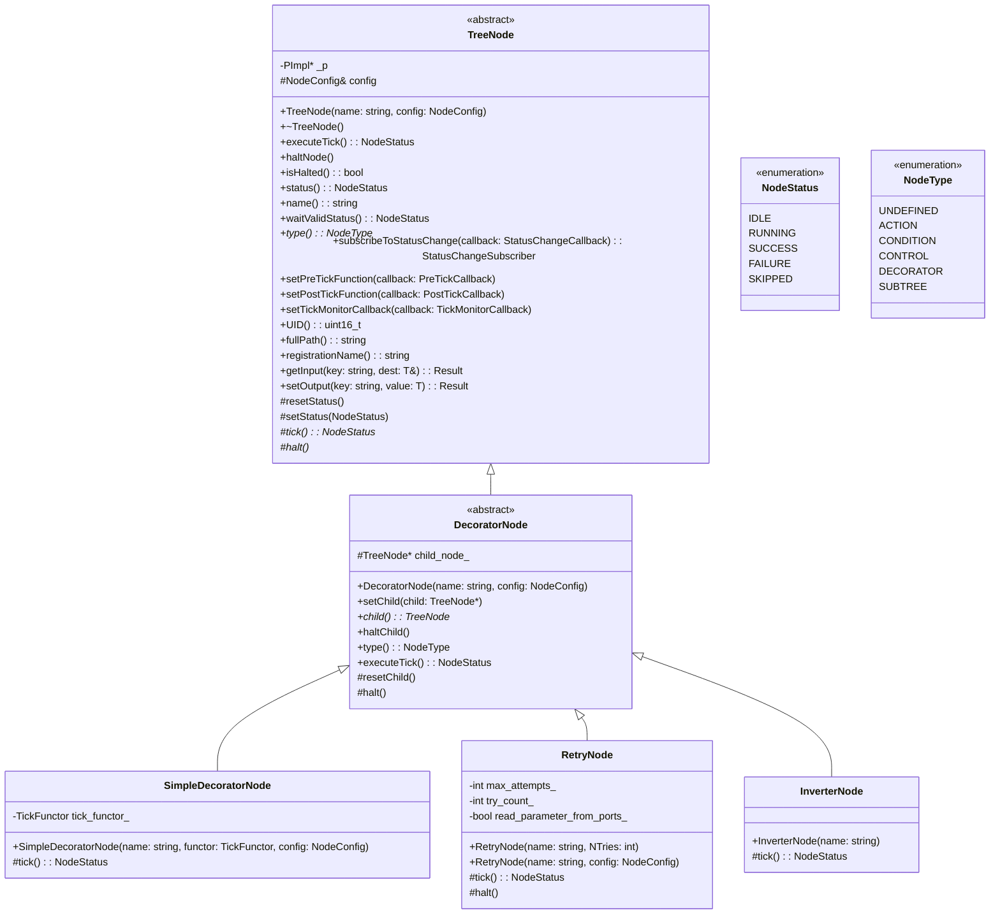

Below is an improved and more structured README that clearly explains the roles of `TreeNode`, `DecoratorNode`, and how virtual vs. implemented functions are organized within the BehaviorTree.CPP framework.

---

# Understanding Virtual vs. Implemented Functions in BehaviorTree.CPP

**Overview:**  
BehaviorTree.CPP employs a class hierarchy where `TreeNode` serves as the base class for all node types. Decorator nodes, leaf nodes, and control nodes derive from this base class, each implementing or extending the fundamental interface defined by `TreeNode`.

## TreeNode (Abstract Base Class)

`TreeNode` is the foundational abstract class that defines the core interface for behavior tree nodes. Some methods are pure virtual, meaning they must be implemented by derived classes, while others are implemented at this level and can be overridden if needed.

**Pure Virtual Methods (Must be Implemented by Derived Classes):**  
- `tick()`  
- `halt()`  
- `type()`

**Implemented Virtual Methods (Already Provided by TreeNode):**  
- `executeTick()`  
- `haltNode()`  
- Other public methods handling generic node logic (e.g., name retrieval, blackboard access)

**Key Point:**  
Because `tick()`, `halt()`, and `type()` are pure virtual, `TreeNode` cannot be instantiated directly. Instead, subclasses must provide concrete implementations for these methods.

## DecoratorNode (Abstract Derived Class)

`DecoratorNode` inherits from `TreeNode` and provides certain implementations while still remaining abstract.

**Implemented from TreeNode:**  
- `halt()` is implemented at the `DecoratorNode` level.  
- `type()` is implemented to return `NodeType::DECORATOR`.  
- `executeTick()` is also implemented, providing a base decorator execution cycle.

**Still Abstract:**  
- `tick()` remains pure virtual, meaning `DecoratorNode` does not provide a default implementation. Any concrete decorator node must define its own `tick()` method.

## Concrete Decorator Classes

Concrete decorator classes such as `RetryNode`, `InverterNode`, and others inherit from `DecoratorNode`. To become fully instantiable, they must implement all pure virtual methods inherited from `TreeNode` and `DecoratorNode`.

**Must Implement:**  
- `tick()`: Defines the core logic of how this particular decorator modifies its child’s execution (e.g., retrying on failure, inverting the result, etc.).

**Optional Overrides:**  
- `halt()`: Although already implemented, a concrete decorator may override it to perform specialized cleanup or state resetting.

**Result:**  
A concrete decorator class has a fully defined behavior and can be used directly in behavior trees.

---

# Inheritance Diagram (Conceptual)

```
       TreeNode (Abstract)
       /       |          \
      /        |           \
DecoratorNode (Abstract)  ControlNode (...)  LeafNode (...)
       |
       |--- RetryNode (Concrete)
       |--- InverterNode (Concrete)
       |--- ... Other Decorators
```

- `TreeNode` defines the abstract interface.
- `DecoratorNode` fills in some of the blanks but still leaves `tick()` abstract.
- Concrete decorator nodes (e.g., `RetryNode`, `InverterNode`) implement `tick()` and possibly override other methods, becoming fully usable nodes.

---

**In Summary:**  
- **`TreeNode`**: Defines the core interface. `tick()`, `halt()`, and `type()` are pure virtual and must be implemented by subclasses.
- **`DecoratorNode`**: Specializes `TreeNode` for decorators, provides implementations for `halt()` and `type()`, but leaves `tick()` abstract.
- **Concrete Decorators (e.g., `RetryNode`, `InverterNode`)**: Implement `tick()` to finalize their behavior. They may also override `halt()` to handle any unique cleanup.

This structure enforces a clear contract: base classes define the interface and fundamental behaviors, while derived classes implement the specific logic needed for each node type.
