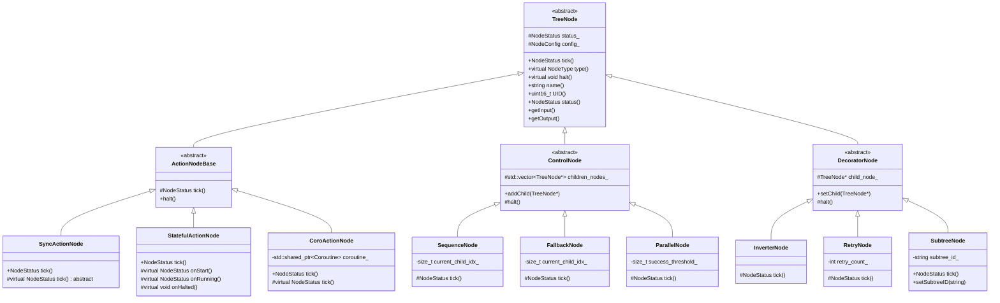

```bash
void applyRecursiveVisitor(const TreeNode* root_node,
                           const std::function<void(const TreeNode*)>& visitor);


class LeafNode : public TreeNode
class ActionNodeBase : public LeafNode
class ConditionNode : public LeafNode

class ControlNode : public TreeNode
class DecoratorNode : public TreeNode
```

```bash
+-------------------+
|     TreeNode      |
+-------------------+
          ^
          |
  +----------------+
  |   ControlNode  |
  +----------------+
          ^
          |
+-----------------------+
|   ReactiveFallback    |
+-----------------------+
| + ReactiveFallback()  |
| + ~ReactiveFallback() |
| + tick(): NodeStatus  |
| + halt()              |
+-----------------------+

```

```bash
+-------------------------------------+
|             TreeNode                |
+-------------------------------------+
| - name_: std::string                |
| - status_: NodeStatus               |
| - uid_: uint16_t                    |
| - config_: NodeConfig               |
| - pre_conditions_: PreScripts       |
| - post_conditions_: PostScripts     |
| - wake_up_signal_: WakeUpSignal     |
+-------------------------------------+
| + TreeNode(name: std::string,       |
|            config: NodeConfig)      |
| + ~TreeNode()                       |
| + executeTick(): NodeStatus         |
| + haltNode()                        |
| + isHalted(): bool                  |
| + status(): NodeStatus              |
| + name(): const std::string&        |
| + waitValidStatus(): NodeStatus     |
| + type(): NodeType (pure virtual)   |
| + UID(): uint16_t                   |
| + fullPath(): const std::string&    |
| + registrationName(): const std::string& |
| + config(): const NodeConfig&       |
| + getInput<T>(key: std::string):    |
|     Expected<T>                     |
| + setOutput<T>(key: std::string,    |
|     value: T): Result               |
| + getLockedPortContent(key:         |
|     std::string): AnyPtrLocked      |
| + getRawPortValue(key: std::string):|
|     StringView                      |
| + emitWakeUpSignal()                |
| + requiresWakeUp(): bool            |
| + ... (other methods)               |
+-------------------------------------+

```




