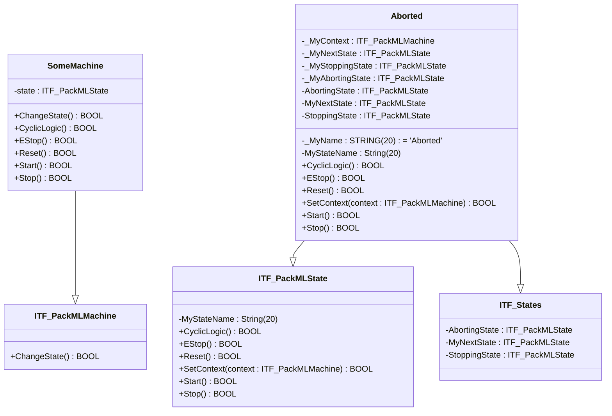

# UML Diagram

sequence of states:

```mermaid
classDiagram
    class ITF_PackMLMachine {
        +ChangeState() BOOL
    }

    class SomeMachine {
        -state : ITF_PackMLState
        +ChangeState() BOOL
        +CyclicLogic() BOOL
        +EStop() BOOL
        +Reset() BOOL
        +Start() BOOL
        +Stop() BOOL
    }

    SomeMachine --|> ITF_PackMLMachine

    class ITF_PackMLState {
        -MyStateName : String(20)
        +CyclicLogic() BOOL
        +EStop() BOOL
        +Reset() BOOL
        +SetContext(context : ITF_PackMLMachine) BOOL
        +Start() BOOL
        +Stop() BOOL
    }

    class ITF_States {
        -AbortingState : ITF_PackMLState
        -MyNextState : ITF_PackMLState
        -StoppingState : ITF_PackMLState
    }


    class Aborted {
        -_MyContext : ITF_PackMLMachine
        -_MyNextState : ITF_PackMLState
        -_MyStoppingState : ITF_PackMLState
        -_MyAbortingState : ITF_PackMLState
        -_MyName : STRING(20) = 'Aborted'
        -AbortingState : ITF_PackMLState
        -MyNextState : ITF_PackMLState
        -MyStateName : String(20)
        -StoppingState : ITF_PackMLState
        +CyclicLogic() BOOL
        +EStop() BOOL
        +Reset() BOOL
        +SetContext(context : ITF_PackMLMachine) BOOL
        +Start() BOOL
        +Stop() BOOL
    }
    Aborted --|> ITF_PackMLState
    Aborted --|> ITF_States
```
