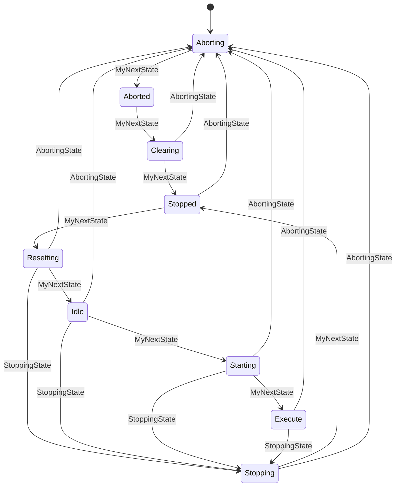

# Sequence Diagram

Here is the UML diagram for the sequence of states:

```mermaid
stateDiagram-v2
    [*] --> Aborting
    Aborting --> Aborted : MyNextState
    Aborted --> Clearing : MyNextState
    Clearing --> Stopped : MyNextState
    Clearing --> Aborting : AbortingState
    Stopping --> Stopped : MyNextState
    Stopping --> Aborting : AbortingState
    Stopped --> Resetting : MyNextState
    Stopped --> Aborting : AbortingState
    Resetting --> Idle : MyNextState
    Resetting --> Aborting : AbortingState
    Resetting --> Stopping : StoppingState
    Idle --> Starting : MyNextState
    Idle --> Aborting : AbortingState
    Idle --> Stopping : StoppingState
    Starting --> Execute : MyNextState
    Starting --> Aborting : AbortingState
    Starting --> Stopping : StoppingState
    Execute --> Aborting : AbortingState
    Execute --> Stopping : StoppingState
```
