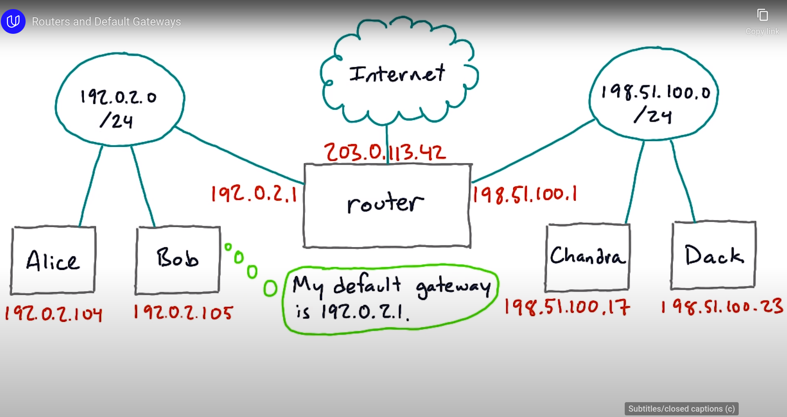
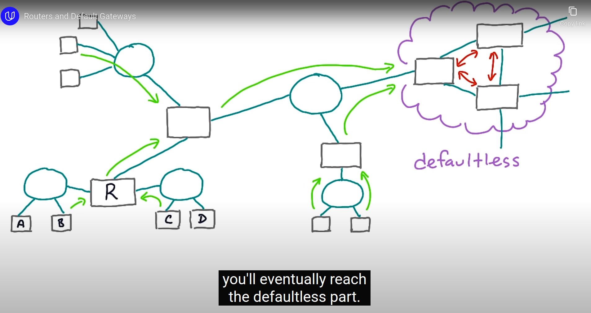
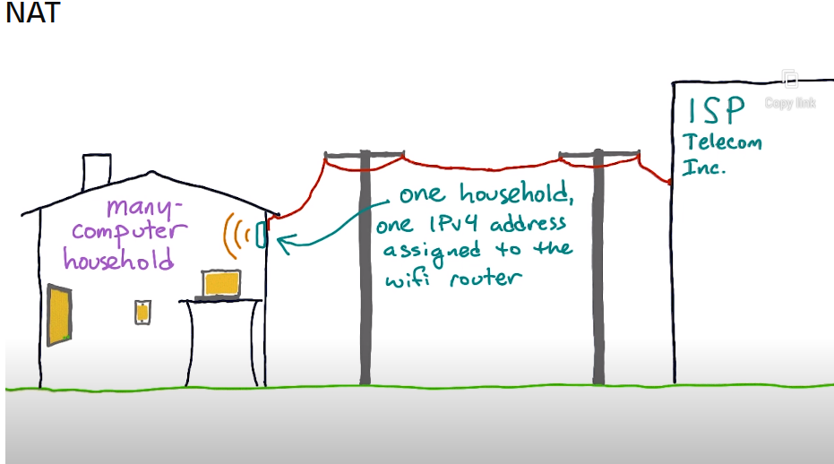
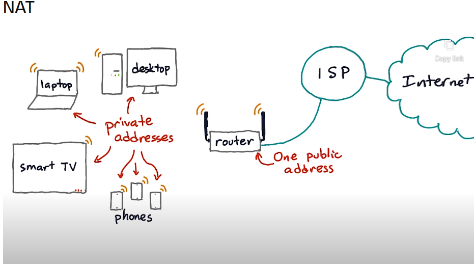
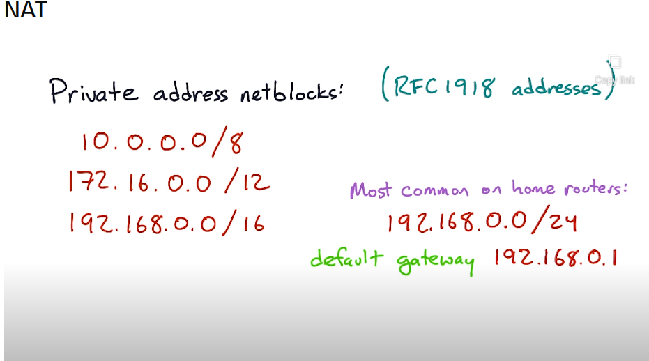
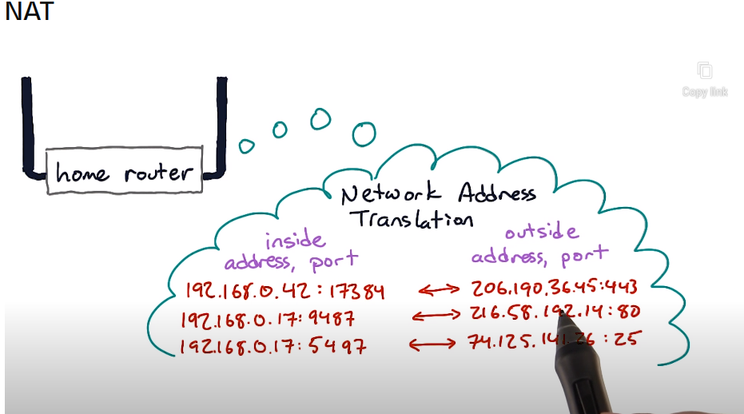
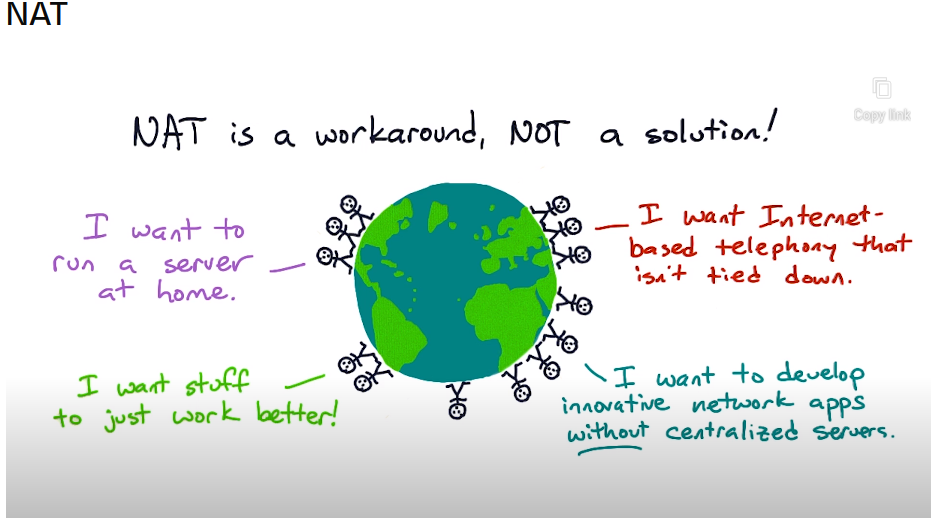
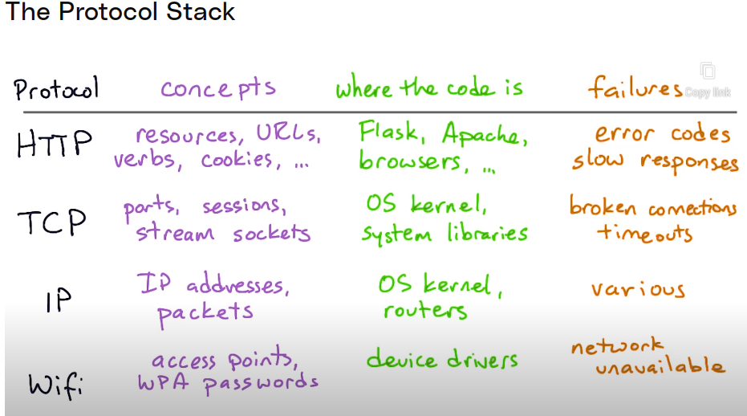

## Basic 

[Udacity course](https://www.udacity.com/course/networking-for-web-developers--ud256)

## Tools

```bash
sudo apt-get update && sudo apt-get upgrade
sudo apt-get install netcat-openbsd tcpdump traceroute mtr
```

## Try some network things

```bash
# Display IP addresses and property information for all network interfaces
ip a  

# Send three ICMP echo requests to Google's public DNS server
ping -c3 8.8.8.8  

# Look up the IPv6 address for google.com. t stands for type
host -t aaaa google.com  

# Look up the IPv4 address for google.com
host -t a google.com  

# Look up the Mail Exchange (MX) records for udacity.com
host -t mx udacity.com  

# Capture the first 5 packets on interface eth0 that use port 22 (SSH). 
# -n: This option tells tcpdump to not resolve hostnames or port names. This can make the output easier to read if you're only interested in IP addresses and port numbers, and it can also make tcpdump faster.
tcpdump -n -c5 -i eth0 port 22 

# Display the network route packets take to reach www.udacity.com
traceroute www.udacity.com  

# Install the Canberra GTK module (currently commented out)
# sudo apt-get install libcanberra-gtk-module libcanberra-gtk3-module  

# Provide a real-time report on the network route to www.udacity.com. mtr - my trace route
mtr www.udacity.com

# Send a simple HTTP HEAD request to www.udacity.com
# nc stands for a netcat and it is a handly tool for manually talking to internet services.
# Here we are giving a command that will connect to udacity web server. But nc does not know anything
# about the HTTP in particular instead of udacity
printf 'HEAD / HTTP/1.1\r\nHost: www.udacity.com\r\n\r\n' | nc www.udacity.com 80

# instead of udacity we can also say hello to ssh server on local host
nc localhost 22

# netcat can act as sort of network swiss army knife to connect to various servers.
# It can also act as server itself.

```

The `lsof` utility lists open files, including network sockets (listening or connected)
```bash
sudo lsof -i
```
Open Browser and type  ` localhost:2345` and in the terminal 

```bash
printf 'HTTP/1.1 302 Moved\r\nLocation: https://www.eff.org/' | nc -l 2345
```

## Names and Address

DNS - Domain name system
The Resolver - THe DNS client code built into your operating system.

The `host` command is a basic utility for looking up records in DNS. It will query your OS Name service. which
usually ends up sending a request to what ever DNS server you computer's configured to use.

```bash
host -t a google.com
man host
dig www.universal-robots.com
```

Register a domain cost around 12$/year
```bash
domains.google.com
```

## Addressing and Networking

IP Network Blocks , Routers, Network Address Translation

NetBlock means the computers that are on the same subnet. Computers that are on the same network block
can communicate with each other with out going through router. example of network block 198.51.100.0/24

The top and bottom address of a network block are reserved, and the first address is ususally the router.

**Hosts (computers) does not have IP address.Interfaces on the hosts have IP address !!**
A host like a laptop can have multiple network interfaces (wired ethernet interface(eth0), wifi interface(wlan0), 
loop back interface(lo), Tunnel interface, virtual machine interfaces, ) and each interface can have zero or more addresses.

Tunnel interface - tunnel to another part of the network

```bash
# list interfaces
ip addr show
```

Thinking about a home router. It has one interface that goes to your ISP, and then one or more interfaces 
that are local, may be an Ethernet or probably a wi-fi access point. Now, the local network, or LAN, 
is where your computers and devices are. Where as the outward facing wide are network or WAN, is the 
interface that connects towards the rest of the internet.


If you notice the image the route can have multiple ip address and multiple interfaces


THe defualt gateway may also have a default gateway itself. But eventually as we go towards the rest of the internet,
you will eventually reach the defaultless part. Where routers on major transit ISPs know about the global routing table,
the directory of all public IP networks.

```bash
# find default gateway
ip route show default
netstat -nr
```

### NAT



This image how all the devices hide behind a single IP on the router







Private IP address are used with a system called NAT or Network address translation. The way that it works is 
that when ever traffic goes between the private network behind the router and the public internet, the router
has to rewrite or translate to the network address on it. The router maintains a map of which inside addresses 
and ports are connected to what public internet addresses and ports




### Private and public

Remember, 'private' IP addresses aren't private in the sense of privacy; they're private in the sense of only 
being used on internal networks.No private address are not private in the sense of being secret or presonal. 
They are private, because they are only any good on the local network. They can not be used directly on the 
public network because they are not unique. Thousands or may be millions of people in the world are using the 
IP address in the 192.168 range, but each one of these is behind a different NAT router


There are 3 different block of ip address which are reserved for this private use. By design these address
should never be used on the public internet. They are used inside home, offices, data centers, on mobile network
and so on. 

If you are using a private adress, there is still a public address being used on other side of your router or
you mobile provider or the like .


Way to find you public IP


## Protocol Layers




Tool `tcpdump` can look at any type of network traffic not just tcp. It is slightly miss named in that sense.

```bash
# capture the data between you PC and host 8.8.8.8
sudo tcpdump -n host 8.8.8.8
# another terminal
ping -c3 8.8.8.8

# listen in for all DNS requests
sudo tcpdump -n port 53
ping -c3 yahoo.com

# web server
sudo tcpdump -n port 80
printf 'HEAD / HTTP/1.1\r\nHost: www.udacity.com\r\n\r\n' | nc www.udacity.com 80
```

## Big Networks

```bash
traceroute google.com
mtr google.com
```

## Serial Port Vs Network Port
### Serial Port (`/dev/ttyUSB0`)

- In the context of `/dev/ttyUSB0`, a serial port refers to a physical or virtual communication interface that allows serial communication between a computer and a device, such as a USB-to-serial converter or a serial device connected via USB.
- `/dev/ttyUSB0` is a device file that represents a specific serial port in the Linux operating system.
- Serial ports are used for serial communication protocols, such as RS-232, RS-485, or UART, which involve sending and receiving data bit by bit over a single wire or multiple wires.
- `/dev/ttyUSB0` is associated with the USB-to-serial device connected to the system and provides a way to read from and write to that device.

### Network Port

- In networking, a network port is a numbered endpoint that identifies a specific application or service running on a device within a network.
- Network ports are used in the TCP/IP protocol suite to allow multiple applications or services to share a single IP address on a networked device.
- Network ports are identified by port numbers ranging from 0 to 65535.
- Commonly used network ports are standardized, such as port 80 for HTTP, port 443 for HTTPS, and port 22 for SSH.
- Network ports facilitate communication between different devices on a network by directing network traffic to the appropriate application or service based on the port number.


