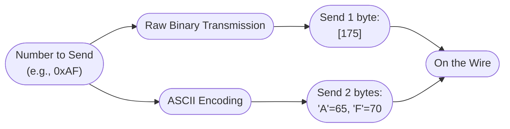
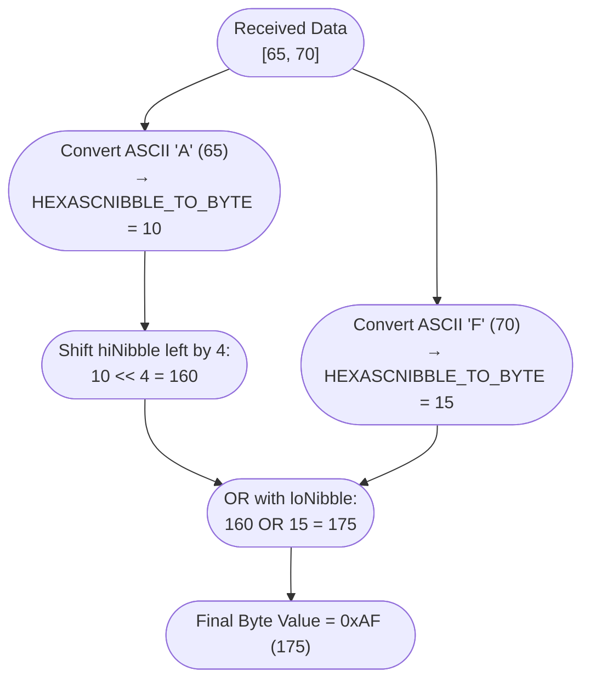

# Understanding Binary vs ASCII Hex Transmission

When working with PLCs, microcontrollers, or communication protocols, numbers can be transmitted **in two fundamentally different ways**:

1. **Raw Binary**  
2. **ASCII (Text) Representation**

This distinction is important for understanding functions like `CHR` and `HEXASCNIBBLE_TO_BYTE` in Beckhoff Structured Text (ST).

---

## 1. Raw Binary Transmission

In raw binary transmission, the value is sent directly as a byte.  

Example: Sending the number **0xAF** (decimal 175)

- **On the wire (1 byte):**
  ```
  [175]
  ```
- **Binary representation:**
  ```
  10101111
  ```
- **Hex representation:**
  ```
  AF
  ```

This is **compact and efficient** (only one byte sent).  
However, it is **not human-readable** — if you open this in a text terminal, you may see garbage characters.

---

## 2. ASCII (Text) Hex Transmission

In ASCII transmission, the value is first converted into human-readable characters.  
The number **0xAF** is split into two hex digits: `"A"` and `"F"`.  

- `"A"` → ASCII code `65` → binary `01000001`
- `"F"` → ASCII code `70` → binary `01000110`

- **On the wire (2 bytes):**
  ```
  [65, 70]
  ```
- **Human-readable:**
  ```
  "AF"
  ```

This is **easy to debug** (you literally see `"AF"` in a terminal) but **less efficient** (2 bytes instead of 1).

---

## 3. ASCII Encoding Explained

When we say **ASCII-encoded hex**, we mean that numbers are sent as **characters** instead of their raw binary values.

- `"A"` (a symbol) is represented by ASCII code `65`.  
- `"F"` is represented by ASCII code `70`.  

So the buffer `[65, 70]` does not directly mean the number 175 — it means the text `"AF"`, which must be converted back into the real number.

Other ways to encode numbers:

1. **Raw binary**: send `[175]` (1 byte, compact, unreadable).  
2. **ASCII hex**: send `"AF"` as `[65, 70]` (2 bytes, human-readable).  
3. **ASCII decimal**: send `"175"` as `[49, 55, 53]` (3 bytes, readable decimal).

---

## 4. Side-by-Side Comparison

| Method       | Bytes Sent   | Human-readable? | Size  |
|--------------|-------------|-----------------|-------|
| Raw Binary   | `[175]`     | ❌ No            | 1 byte |
| ASCII (Hex)  | `[65, 70]`  | ✅ Yes → `"AF"`  | 2 bytes |
| ASCII (Dec)  | `[49, 55, 53]` | ✅ Yes → `"175"` | 3 bytes |

---

## 5. Conversion in Beckhoff ST

When a PLC receives ASCII-encoded hex, it must convert it back to a numeric value.

Example: Receiving `"AF"`

1. RX buffer contains `[65, 70]`.
2. Convert each ASCII code with `HEXASCNIBBLE_TO_BYTE`:
   - `HEXASCNIBBLE_TO_BYTE(65)` → `10` (decimal for hex digit `A`)
   - `HEXASCNIBBLE_TO_BYTE(70)` → `15` (decimal for hex digit `F`)
3. Combine:
   ```pascal
   value := SHL(hiNibble, 4) OR loNibble;  // = 175 = 0xAF
   ```

---

### 🔍 Why shift left by 4?

Each hex digit is a **nibble** (4 bits).  
A byte has **two nibbles**: a high nibble and a low nibble.

- High nibble (`A` = 10 = `1010`) must be placed in the **upper 4 bits**.  
  ```
  00001010   (10 decimal)
  SHL(hiNibble, 4) = 10100000
  ```
- Low nibble (`F` = 15 = `1111`) stays in the **lower 4 bits**.  
- Combine them with OR:
  ```
  10100000
  00001111
  --------
  10101111   (0xAF = 175)
  ```

👉 We only shift by **4** because each hex digit fits in 4 bits. Shifting any more would move it outside of the 8-bit byte.

💡 **Decimal analogy**:  
To build the number `35` from digits `3` and `5`, we do `3*10 + 5`.  
In hex, base is 16 → `10*16 + 15 = 175`.

---

## 6. Flow Charts

### Transmission Flow (Binary vs ASCII Encoding)



---

### Reception Flow (Conversion back to Byte)



---

## 7. Why Two Formats Exist

- **Binary Protocols**  
  Examples: Modbus RTU, CAN, SPI, I²C  
  - Efficient, compact  
  - Hard to debug without tools

- **ASCII Protocols**  
  Examples: Modbus ASCII, NMEA GPS, AT commands, HTTP headers  
  - Easy to debug in plain text  
  - Uses more bandwidth

---

## 8. Quick Reference

- Use `CHR(byte)` → convert a byte into a single-character string.  
- Use `HEXASCNIBBLE_TO_BYTE(asc)` → convert ASCII `"0"`..`"F"` into its numeric value (0–15).  
- Combine two nibbles to reconstruct a full byte.

---

✅ **Summary**:  
- Raw binary is compact but unreadable.  
- ASCII hex is verbose but human-friendly.  
- PLC functions like `CHR` and `HEXASCNIBBLE_TO_BYTE` help you **translate between raw bytes and readable text** in communication protocols.
